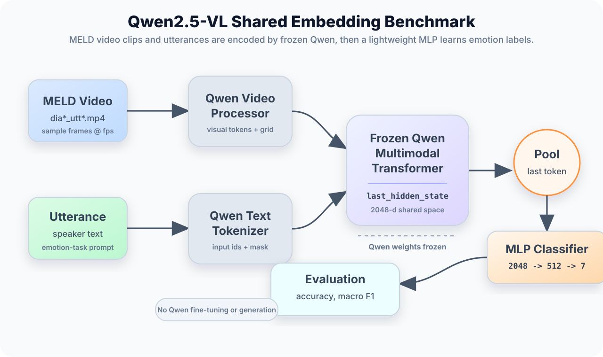
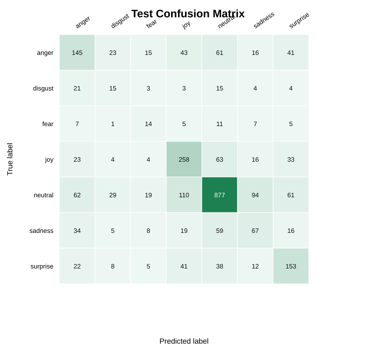

# Emo Benchmark

A lightweight benchmark for multimodal emotion recognition with frozen vision-language model embeddings. The current experiments use MELD video clips and utterances, extract representations from `Qwen/Qwen2.5-VL-3B-Instruct`, and train a small MLP classifier for seven-way emotion recognition.

The main idea is intentionally simple:

```text
video clip + utterance
  -> frozen VLM embedding extractor
  -> pooled 2048-d representation
  -> lightweight MLP classifier
  -> accuracy, macro F1, weighted F1, confusion matrix
```

## Current Result

The best current run uses shared video-text hidden states from Qwen2.5-VL-3B-Instruct. Qwen is not fine-tuned and `model.generate()` is not used; embeddings are extracted before the language-model head and then classified with an MLP.

| Representation | Dev Accuracy | Dev Macro F1 | Test Accuracy | Test Macro F1 | Notes |
|---|---:|---:|---:|---:|---|
| Video-only Qwen features | 0.3158 | 0.2204 | - | - | Visual features from `get_video_features()` |
| Shared video + utterance Qwen states | 0.6107 | 0.4872 | 0.5883 | 0.4336 | Final shared hidden state with emotion-task prompt |

The jump from video-only to shared video-text embeddings shows that MELD emotion recognition depends strongly on utterance semantics as well as visual cues. The model performs best on higher-support classes such as neutral, joy, surprise, and anger, while rare classes such as disgust and fear remain more difficult.

Detailed metrics and figures are available in [results/qwen2_5_vl_3b_shared](results/qwen2_5_vl_3b_shared/README.md).

## Architecture





## Dataset Example

The repository does not redistribute MELD videos or labels. After downloading MELD.Raw, each sample is indexed like this:

| Field | Example |
|---|---|
| `sample_id` | `train_dia0_utt4` |
| `video_file` | `dia0_utt4.mp4` |
| `utterance` | corresponding MELD utterance text |
| `emotion` | one of `anger`, `disgust`, `fear`, `joy`, `neutral`, `sadness`, `surprise` |

For shared embedding extraction, each MELD row is converted to a Qwen message containing the video path and the utterance text:

```python
messages = [
    {
        "role": "user",
        "content": [
            {"type": "video", "video": video_path, "fps": 6, "max_frames": 64},
            {
                "type": "text",
                "text": (
                    "Task: infer the speaker's emotion from the video and utterance as exactly one of:\n"
                    "Emotion choices: anger, disgust, fear, joy, neutral, sadness, surprise.\n"
                    f"Utterance: {utterance}\n"
                    "Focus on facial expression, body cues, scene context, and wording."
                ),
            },
        ],
    }
]
```

## Dataset layout

Datasets are intentionally not tracked by Git. Place local datasets under `dataset/`:

```text
emo-benchmark/
  dataset/
    MELD.Raw/
      train/
        train_sent_emo.csv
        train_splits/
      dev_sent_emo.csv
      dev_splits_complete/
      test_sent_emo.csv
      output_repeated_splits_test/
```

## Benchmark Pipeline

```text
MELD video clips
  -> sample video frames
  -> extract frozen VLM embeddings before generation/decoder output
  -> pool embeddings per sample
  -> train a lightweight MLP classifier
  -> evaluate accuracy, macro F1, weighted F1, and confusion matrix
```

Generated embeddings and intermediate runtime outputs are ignored by Git:

```text
embeddings/
outputs/
```


## Environment setup

For Colab, install dependencies at the top of the notebook:

```bash
pip install -r requirements.txt
```

For local development, create a virtual environment first:

```bash
python -m venv .venv
source .venv/bin/activate
pip install -r requirements.txt
```

The `.venv/` folder is ignored by Git.

## Prepare MELD indexes

After placing `MELD.Raw` under `dataset/`, build verified split indexes:

```bash
python scripts/prepare_meld.py --meld-root dataset/MELD.Raw --split all
```

For a quick smoke test, limit rows per split:

```bash
python scripts/prepare_meld.py --meld-root dataset/MELD.Raw --split train --limit 100
```


## Extract Qwen video embeddings

Extract frozen Qwen2.5-VL video embeddings before language generation:

```bash
python scripts/extract_qwen_embeddings.py \
  --index-csv outputs/indexes/meld_train_index.csv \
  --output-pt embeddings/qwen2_5_vl_3b/meld_train_100.pt \
  --fps 6 \
  --max-frames 64 \
  --limit 100
```

The extractor uses Qwen as a frozen visual representation model and does not call `model.generate()`.

## Extract shared Qwen video+utterance embeddings

To include the MELD utterance with the corresponding video, use the shared extractor:

```bash
python scripts/extract_qwen_shared_embeddings.py \
  --index-csv outputs/indexes/meld_train_index.csv \
  --output-pt embeddings/qwen2_5_vl_3b_shared/meld_train_100.pt \
  --fps 6 \
  --max-frames 64 \
  --pooling last \
  --prompt-style emotion_task \
  --limit 100
```

This runs Qwen with both video frames and the utterance text, appends Qwen's assistant-generation marker, then pools hidden states from the multimodal transformer before the LM head. The default prompt includes the seven emotion choices without revealing the gold label. The saved `.pt` file has the same structure as the video-only embeddings, so it can be passed directly to `train_mlp.py`.

## Alpha-weighted modality fusion

For modality overshadowing, extract video-only and text-only embeddings from the same Qwen LM hidden-state space:

```bash
python scripts/extract_qwen_shared_embeddings.py \
  --index-csv outputs/indexes/meld_train_index.csv \
  --output-pt embeddings/qwen2_5_vl_3b_lm_video_only/meld_train.pt \
  --fps 6 \
  --max-frames 64 \
  --pooling last \
  --prompt-style emotion_task \
  --modality-mode video_only

python scripts/extract_qwen_shared_embeddings.py \
  --index-csv outputs/indexes/meld_train_index.csv \
  --output-pt embeddings/qwen2_5_vl_3b_lm_text_only/meld_train.pt \
  --fps 6 \
  --max-frames 64 \
  --pooling last \
  --prompt-style emotion_task \
  --modality-mode text_only
```

Repeat for `dev` and `test`. Then create one fused embedding set:

```bash
python scripts/fuse_modality_embeddings.py \
  --video-train-pt embeddings/qwen2_5_vl_3b_lm_video_only/meld_train.pt \
  --text-train-pt embeddings/qwen2_5_vl_3b_lm_text_only/meld_train.pt \
  --video-dev-pt embeddings/qwen2_5_vl_3b_lm_video_only/meld_dev.pt \
  --text-dev-pt embeddings/qwen2_5_vl_3b_lm_text_only/meld_dev.pt \
  --video-test-pt embeddings/qwen2_5_vl_3b_lm_video_only/meld_test.pt \
  --text-test-pt embeddings/qwen2_5_vl_3b_lm_text_only/meld_test.pt \
  --output-dir embeddings/qwen2_5_vl_3b_alpha/alpha_0_50 \
  --alpha 0.5
```

This computes:

```text
fused = alpha * standardized_video + (1 - alpha) * standardized_text
```

To run the full sweep:

```bash
python scripts/run_alpha_sweep.py \
  --video-dir embeddings/qwen2_5_vl_3b_lm_video_only \
  --text-dir embeddings/qwen2_5_vl_3b_lm_text_only \
  --fused-root embeddings/qwen2_5_vl_3b_alpha \
  --output-root outputs/qwen2_5_vl_3b_alpha \
  --epochs 50
```

Summarize the sweep:

```bash
python scripts/summarize_alpha_sweep.py \
  --output-root outputs/qwen2_5_vl_3b_alpha \
  --output-csv outputs/qwen2_5_vl_3b_alpha/summary.csv
```

Here `alpha` is the video weight and `1 - alpha` is the text weight. If the best macro F1 occurs near `alpha=0.0`, the classifier is text-dominant. If it occurs near `alpha=1.0`, it is video-dominant. A best value near `alpha=0.5` suggests balanced fusion.

If Kaggle stops a long extraction run, rerun the same command with `--resume`. Existing `sample_ids` in the output file are skipped, so only missing clips are extracted:

```bash
python scripts/extract_qwen_shared_embeddings.py \
  --index-csv outputs/indexes/meld_train_index.csv \
  --output-pt embeddings/qwen2_5_vl_3b_shared/meld_train.pt \
  --fps 6 \
  --max-frames 64 \
  --pooling last \
  --prompt-style emotion_task \
  --save-dtype float32 \
  --gc-every 5 \
  --resume
```

Previous error samples are skipped during resume by default. Add `--retry-errors` if you want to attempt them again.

For long Kaggle runs, prefer chunked extraction. Each chunk launches a fresh Python process, so RAM is released between chunks. If a partial merged file already exists, `--seed-pt` copies its existing `sample_ids` into the matching chunk files first:

```bash
python scripts/run_qwen_shared_chunks.py \
  --index-csv outputs/indexes/meld_train_index.csv \
  --chunks-dir embeddings/qwen2_5_vl_3b_shared_chunks/train \
  --chunk-prefix train \
  --chunk-size 500 \
  --seed-pt embeddings/qwen2_5_vl_3b_shared/meld_train.pt \
  --fps 6 \
  --max-frames 64 \
  --pooling last \
  --prompt-style emotion_task \
  --save-dtype float32 \
  --gc-every 5
```

After all chunks finish, merge them into the single file expected by `train_mlp.py`:

```bash
python scripts/merge_embedding_chunks.py \
  --chunks-dir embeddings/qwen2_5_vl_3b_shared_chunks/train \
  --output-pt embeddings/qwen2_5_vl_3b_shared/meld_train.pt \
  --pattern "train_*.pt"
```

## Train MLP classifier

After extracting embeddings for train and dev splits, train the lightweight classifier:

```bash
python scripts/train_mlp.py \
  --train-pt embeddings/qwen2_5_vl_3b_shared/meld_train.pt \
  --dev-pt embeddings/qwen2_5_vl_3b_shared/meld_dev.pt \
  --test-pt embeddings/qwen2_5_vl_3b_shared/meld_test.pt \
  --output-dir outputs/qwen2_5_vl_3b_shared \
  --hidden-dim 512 \
  --epochs 50
```

Under the hood, the trainer standardizes embeddings using train-set mean/std, trains a one-hidden-layer MLP, and selects the best checkpoint by dev macro F1.

## Evaluate saved MLP

Evaluate a trained checkpoint on dev or test embeddings without retraining:

```bash
python scripts/evaluate_mlp.py \
  --checkpoint outputs/qwen2_5_vl_3b/best_mlp.pt \
  --embeddings-pt embeddings/qwen2_5_vl_3b/meld_test.pt \
  --output-dir outputs/qwen2_5_vl_3b \
  --split-name test
```

Under the hood, this reloads the MLP, applies the train-set feature mean/std saved in the checkpoint, and writes metrics plus per-sample predictions.
