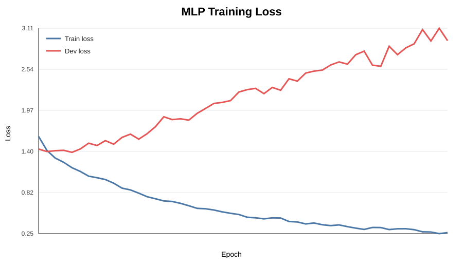
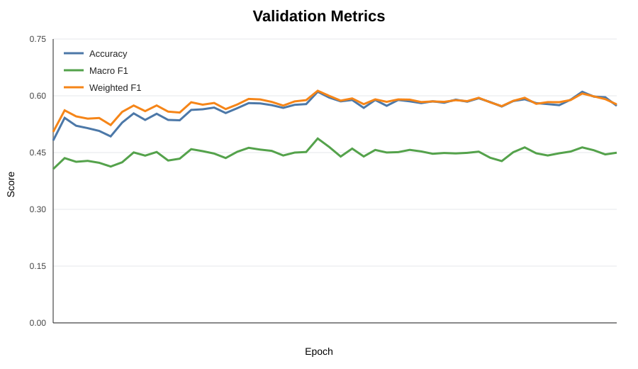
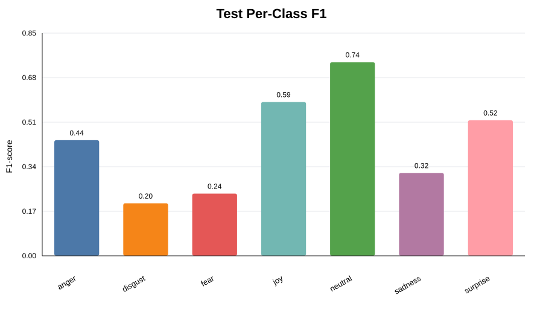

# Qwen2.5-VL-3B Shared Embedding Results on MELD

This result evaluates frozen shared video-text embeddings from `Qwen/Qwen2.5-VL-3B-Instruct` on MELD emotion recognition. Qwen is used as an embedding extractor, not as a generated-answer classifier: each video clip is paired with its utterance, the final shared hidden state is pooled into a 2048-dimensional vector, and a lightweight MLP is trained on top.

## Setup

| Item | Value |
|---|---:|
| Dataset | MELD.Raw |
| Train embeddings | 9966 x 2048 |
| Dev embeddings | 1102 x 2048 |
| Test embeddings | 2599 x 2048 |
| Embedding model | Qwen2.5-VL-3B-Instruct |
| Embedding type | Shared video + utterance hidden state |
| Video sampling | 6 fps, max 64 frames |
| Pooling | Last token hidden state |
| Classifier | MLP, 2048 -> 512 -> 7 |

## Main Metrics

| Split | Accuracy | Macro F1 | Weighted F1 |
|---|---:|---:|---:|
| Dev | 0.6107 | 0.4872 | 0.6132 |
| Test | 0.5883 | 0.4336 | 0.5948 |

## Test Per-Class Report

| Class | Precision | Recall | F1 | Support |
|---|---:|---:|---:|---:|
| anger | 0.462 | 0.422 | 0.441 | 344 |
| disgust | 0.176 | 0.231 | 0.200 | 65 |
| fear | 0.206 | 0.280 | 0.237 | 50 |
| joy | 0.539 | 0.643 | 0.586 | 401 |
| neutral | 0.780 | 0.700 | 0.738 | 1252 |
| sadness | 0.310 | 0.322 | 0.316 | 208 |
| surprise | 0.489 | 0.548 | 0.517 | 279 |

## Interpretation

Shared video-text embeddings are substantially stronger than the earlier video-only Qwen features. The video-only run reached about 31.6% dev accuracy and 0.22 macro F1, while the shared video-text run reaches 61.1% dev accuracy and 0.487 macro F1. This suggests that MELD emotion recognition depends heavily on utterance semantics in addition to visual cues.

The model is strongest on higher-support classes such as neutral, joy, surprise, and anger. Disgust and fear remain difficult because they have low support and are often semantically or visually close to anger, sadness, or neutral. The gap between weighted F1 and macro F1 also shows the effect of class imbalance: neutral dominates the dataset, so macro F1 is the more honest signal for minority-class behavior.

## Figures

## Notes

The repository does not include MELD videos, raw labels, full prediction CSVs, extracted embeddings, or the trained checkpoint. Place `MELD.Raw` under `dataset/` and run the scripts in the project README to reproduce the artifacts locally or on Kaggle.
